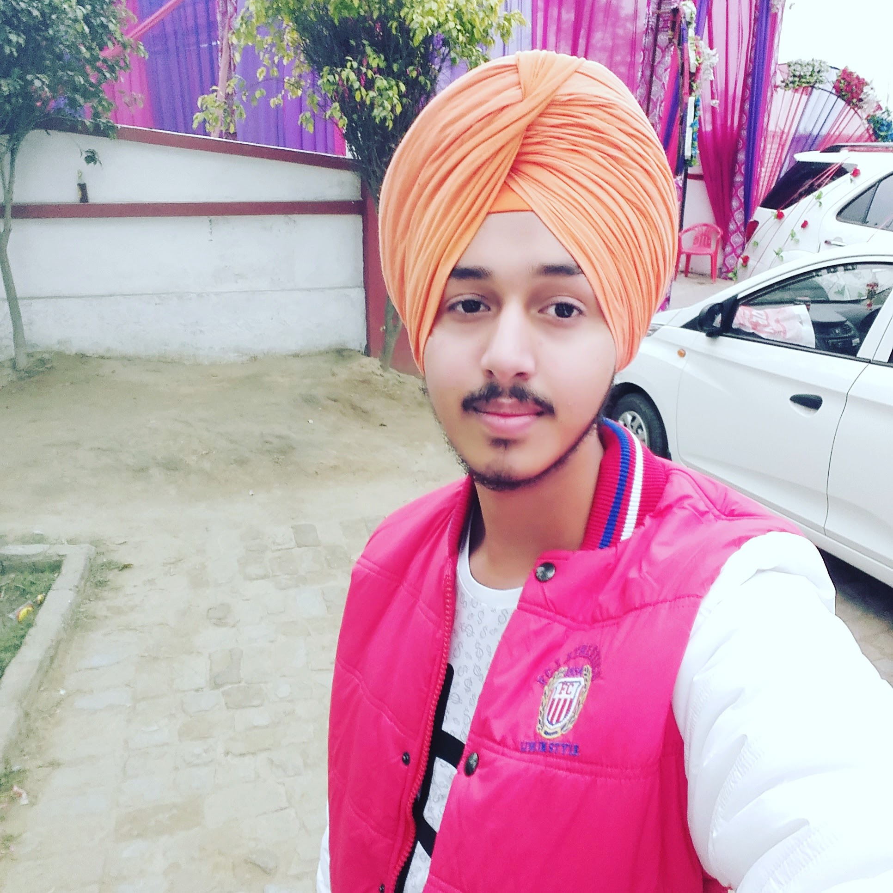

# Hi there 👋🏼

## I'm Gurkiran Singh

I'm a enthusiatic developer. I'm 21 years old. I am a tech enthusiast and actively remain on the watch for new tech products. I like _learning about how things work_ and am _fascinated about how computers work_.

### ⚡ Fun facts

I grew up taking things apart, starting with toys, and later moved on to computers, laptops, phones, etc. By the age of 10, I got bored of cartoons and started watching shows like _How it's Made_ and _Mega Factories_ on _Discovery_ and _National Geographic_. I picked up _3D modelling_ at 13, and that has been one of my favourite pastimes.

### 🌱 Interests

I'm interested in _**Interactive Multimedia**_, _**Creative Coding**_, and _**Visual and Abstract Programming**_. I've recently started reading a book titled _"About Face: The Essentials of Interaction Design"_. By the way, I love board games.

### 🛠 Skillset

My primary interest is in _**Web Development**_, and I've been writing web stack code since the last 2 years. I particularly love working on the _front-end_. I have good knowledge of `HTML`, `CSS`, and `JavaScript`, with further experience in `React` and some `ember`. Of late, I prefer using `TypeScript` over `JavaScript`. On the _front-end_, other technologies I've used are `JQuery`, `Bootstrap`, `Webpack`, `Gulp`, `EJS`, `SCSS`, etc. On the _back-end_, I've some experience with `Node` (plus `Express`), and `PHP`.On the database side, I have decent amount of knowledge in `Firebase`, `MySQL` and `MongoDB`. I'm familiar with _REST_ and have experience with `GraphQL.js`. I've testing experience with `Jest` and `Mocha`.

### 🔭 Working on ...

I'm currently contributing in [_**Eventyay**_](https://github.com/fossasia/open-event-frontend/), which is a open source event scheduling platform by [_FOSSASIA_](https://github.com/fossasia) organization and also, I am contributing in [_**Grommet**_](https://github.com/grommet/grommet/) which is `React` based design system for the UI made using the Storybook. The goal is to take on the challenges encountered due to the original architecture, and build a more robust and reliable application, from the ground up. I also have plans to undertake the development of a _**Physics World**_ simulating _Dynamics_, to aid high school students.

### 📚 Learning ...

I've started learning the `Rust` programming language and `Web Assembly` paraphernalia. Lately, I've been inquisitive about architecture of software and systems. I'm reading a book titled _"Linux Kernel Development"_ by _Robert Love_. I want to dive into embedded systems programming soon.
